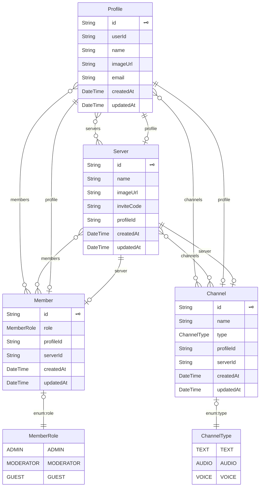

```mermaid
erDiagram
   MemberRole {
    ADMIN ADMIN
    MODERATOR MODERATOR
    GUEST GUEST
   }
    
   ChannelType {
    TEXT TEXT
    AUDIO AUDIO
    VOICE VOICE
   }
    
  "Profile" {
    String id "🗝️"
    String userId 
    String name 
    String imageUrl 
    String email 
    DateTime createdAt 
    DateTime updatedAt 
    }
  

  "Server" {
    String id "🗝️"
    String name 
    String imageUrl 
    String inviteCode 
    String profileId 
    DateTime createdAt 
    DateTime updatedAt 
    }
  

  "Member" {
    String id "🗝️"
    MemberRole role 
    String profileId 
    String serverId 
    DateTime createdAt 
    DateTime updatedAt 
    }
  

  "Channel" {
    String id "🗝️"
    String name 
    ChannelType type 
    String profileId 
    String serverId 
    DateTime createdAt 
    DateTime updatedAt 
    }
  
    "Profile" o{--}o "Server" : "servers"
    "Profile" o{--}o "Member" : "members"
    "Profile" o{--}o "Channel" : "channels"
    "Server" o|--|| "Profile" : "profile"
    "Server" o{--}o "Member" : "members"
    "Server" o{--}o "Channel" : "channels"
    "Member" o|--|| "MemberRole" : "enum:role"
    "Member" o|--|| "Profile" : "profile"
    "Member" o|--|| "Server" : "server"
    "Channel" o|--|| "ChannelType" : "enum:type"
    "Channel" o|--|| "Profile" : "profile"
    "Channel" o|--|| "Server" : "server"
```
